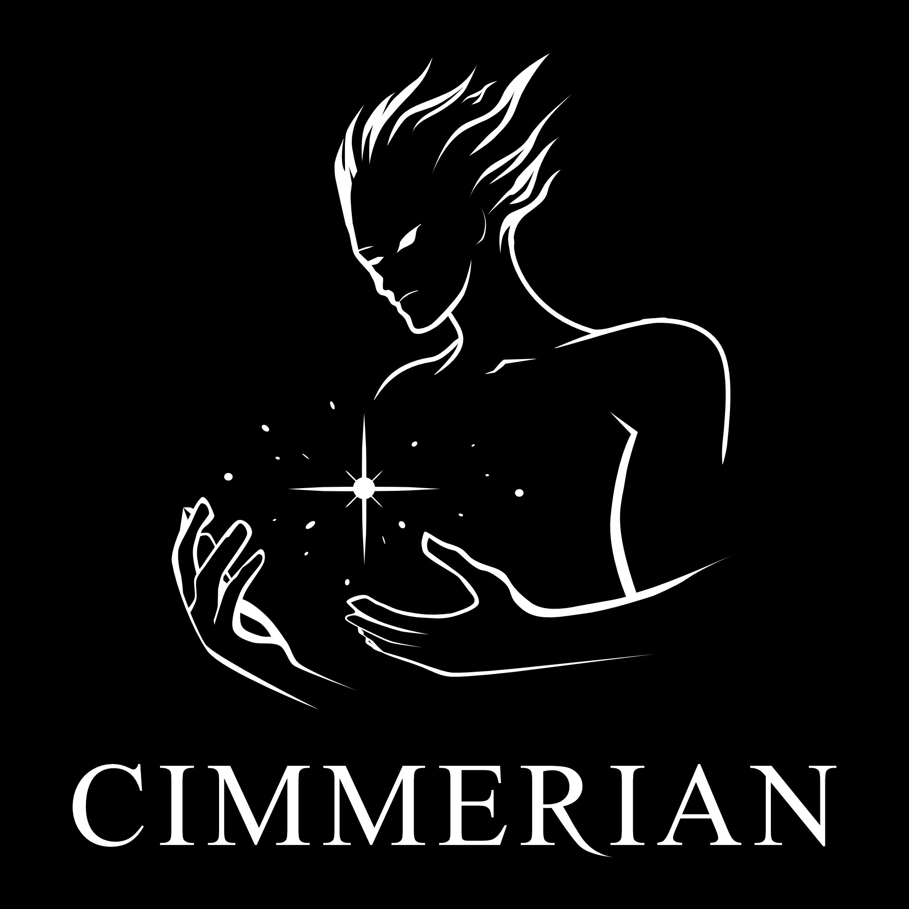

# Cimmerian

<p align="center">

</p>

A modern C++20 unit testing framework. BDD-style test authoring, visual diff output on failure, and built-in performance timing — with zero external dependencies.

```
[Example Tests]
[Math]
[PASS] [Math] Addition  (0.0005ms)
[Math] group total: 0.0021ms

[Strings]
[FAIL] [Strings] Compare greetings  (0.0003ms)
  + "hello world"
  - "hello wurld"

────────────────────────────────────────
Summary: 4 total, 3 passed, 1 failed
Slowest: [Math] Fibonacci  (0.0034ms)
────────────────────────────────────────
```

---

## Requirements

- C++20 or later
- CMake 3.20+
- A compiler with `std::format` support (GCC 13+, Clang 16+, MSVC 19.29+)

---

## Installation

Clone the repository and add it as a subdirectory in your CMake project:

```bash
git clone https://github.com/DeanWilsonDev/Cimmerian.git
```

```cmake
# CMakeLists.txt
add_subdirectory(Cimmerian)

add_executable(my_tests
  test/my.test.cpp
  test/test-main.cpp
)

target_link_libraries(my_tests PRIVATE cimmerian)
target_compile_features(my_tests PUBLIC cxx_std_20)
```

Install locally as library:

```
cmake -B build -DCMAKE_INSTALL_PREFIX=$HOME/.local -DCIMMERIAN_BUILD_TESTS=OFF
cmake --build build
cmake --install build
```

---

## Quick Start

**1.Either:**

- A. Write a test entry point:

```cpp
// test/test-main.cpp
#include "cimmerian/test.hpp"

int main() {
  Cimmerian::TestRunner runner;
  auto summary = runner.RunAll(&Cimmerian::TestRegistry::GetInstance());
  return summary.failed > 0 ? 1 : 0;
}
```

- B. Use the provided entry point:

```cpp
// test/test-main.cpp
#include <cimmerian/test-entry-point.hpp>
```


**2. Write your tests**

```cpp
// test/math.test.cpp
#include "cimmerian/test.hpp"
#include <vector>

DESCRIBE("Math", {
  IT("adds two numbers", {
    ASSERT_EQUAL(1 + 1, 2);
  });

  IT("compares vectors", {
    std::vector<int> a = {1, 2, 3};
    std::vector<int> b = {1, 2, 3};
    ASSERT_EQUAL(a, b);
  });
});
```

**3. Build and run**

```bash
cmake -B build
cmake --build build
./build/my_tests
```

---

## Authoring Tests

### `DESCRIBE` — group your tests

Groups can be nested arbitrarily. Each `DESCRIBE` inside another creates a child group.

```cpp
DESCRIBE("User", {
  DESCRIBE("Authentication", {
    IT("accepts a valid token", { ... });
    IT("rejects an expired token", { ... });
  });

  DESCRIBE("Profile", {
    IT("returns the correct username", { ... });
  });
});
```

### `IT` / `TEST` — define a test case

`IT` and `TEST` are aliases — use whichever reads better.

```cpp
IT("returns zero for empty input", {
  ASSERT_EQUAL(compute(""), 0);
});
```

### `IT_FN` / `TEST_FN` — register a function as a test

Useful for table-driven or shared test logic.

```cpp
void myTest(void*) {
  ASSERT_TRUE(someCondition());
}

IT_FN("my test", myTest);
```

### Lifecycle hooks

```cpp
DESCRIBE("Database", {
  BEFORE_ALL({ db_connect(); });
  AFTER_ALL({ db_disconnect(); });
  BEFORE_EACH({ db_clear(); });
  AFTER_EACH({ db_reset(); });

  IT("inserts a record", { ... });
  IT("finds a record", { ... });
});
```

| Hook | Runs |
|---|---|
| `BEFORE_ALL` | Once before all tests in the group |
| `AFTER_ALL` | Once after all tests in the group |
| `BEFORE_EACH` | Before every test in the group |
| `AFTER_EACH` | After every test in the group |

---

## Assertions

### Continuing assertions

These report failure and continue running the rest of the test.

| Macro | Fails when |
|---|---|
| `ASSERT_TRUE(cond)` | `cond` is false |
| `ASSERT_FALSE(cond)` | `cond` is true |
| `ASSERT_EQUAL(a, b)` | `a != b` |
| `ASSERT_NOT_EQUAL(a, b)` | `a == b` |

### Halting assertions

These report failure and immediately stop the current test via `return`.

| Macro | Fails when |
|---|---|
| `REQUIRE_TRUE(cond)` | `cond` is false |
| `REQUIRE_EQUAL(a, b)` | `a != b` |

---

## Diff Output

`ASSERT_EQUAL` produces a visual diff on failure. Differing elements are highlighted with bright colour and underline. Missing elements appear as `∅`. Extra elements appear with strikethrough.

**Scalars**
```
  + 42
  - 43
```

**Strings — character level**
```
  + "hello world"
  - "hello wurld"
```

**Containers — element level**
```
  + [1, 2, 3, 4]
  - [1, 2, 9, ∅]
```

Diff is supported for scalars, `std::string`, `const char*`, C-style arrays, and any iterable container whose elements implement `std::format`.

---

## Performance Timing

Every test is timed automatically. No configuration required.

```
[PASS] [Math] Addition  (0.0005ms)
[PASS] [Math] Fibonacci  (0.0034ms)
[Math] group total: 0.0039ms

────────────────────────────────────────
Summary: 2 total, 2 passed, 0 failed
Slowest: [Math] Fibonacci (0.0034ms)
────────────────────────────────────────
```

Timing is reported per test, per group, for the total suite, and highlights the slowest test in the summary.

---

## Project Structure

```
Cimmerian/
├── include/cimmerian/       — public headers
│   ├── test.hpp             — single include entry point
│   ├── test-registry.hpp    — test tree registration
│   ├── test-runner.hpp      — execution and timing
│   ├── test-assertions.hpp  — typed assertions and diff output
│   ├── test-log.hpp         — coloured terminal logging
│   └── ansi-formatter.hpp   — ANSI colour helpers
├── src/                     — implementation files
├── test/                    — Cimmerian's own self-tests
└── CMakeLists.txt
```

---

## Contributing

Cimmerian will not be accepting contributions at this time. Feel free to raise an issue if you have a problem and I will try to resolve it quickly. Thank you.

---

## License

MIT — see [LICENSE](LICENSE) for details.
